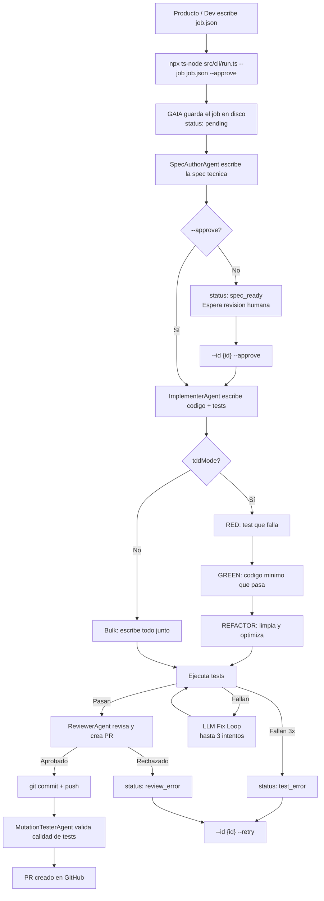

# GAIA CLI Mode — Guía para Producto

> Cómo usar GAIA en modo artesano/local sin depender del servidor HTTP. Pensada para personas de producto que quieren entender el flujo sin leer código.

---

## TL;DR

GAIA CLI Mode es una forma de pedirle a GAIA que programe una feature ejecutando un solo comando en la terminal.

1. El usuario (dev o producto) escribe una **ficha de trabajo** en un archivo llamado `job.json`.
2. Ejecuta `npx ts-node src/cli/run.ts --job job.json --approve`.
3. GAIA genera una propuesta técnica (spec), la implementa, corre tests, revisa la calidad y sube el código a GitHub.
4. Al final entrega el enlace del Pull Request.

Si no se usa `--approve`, GAIA se detiene después de generar la spec para que un humano la revise.

---

## ¿Qué es el CLI Mode?

GAIA tiene tres formas de uso:

| Modo             | Forma de lanzar                                  | Para quién                                     |
| ---------------- | ------------------------------------------------ | ---------------------------------------------- |
| **HTTP Mode**    | Peticiones a un servidor (`POST /jobs`)          | Producción, CI/CD, integraciones               |
| **CLI Mode**     | Un comando en la terminal                        | Desarrollo local, trabajo artesanal con un dev |
| **Webhook Mode** | Disparadores automáticos desde Jira/Slack/GitHub | Automatización de tickets                      |

El **CLI Mode** es el más directo: no hay servidor, no hay base de datos externa, no hay polling. GAIA guarda todo en archivos locales dentro de la carpeta `progress/` del proyecto.

**Analogía:** HTTP Mode es como pedir comida por app y esperar notificaciones. CLI Mode es como cocinar en casa con una receta escrita.

---

## ¿Qué tecnología usa?

No es necesario entender todos los detalles técnicos, pero aquí va un resumen de lo que hay debajo del capó:

| Tecnología                 | ¿Qué es?                                                                               | ¿Para qué sirve en GAIA CLI Mode?                                                                    |
| -------------------------- | -------------------------------------------------------------------------------------- | ---------------------------------------------------------------------------------------------------- |
| **Node.js**                | El entorno que ejecuta programas escritos en JavaScript/TypeScript.                    | Es el motor que corre GAIA en tu computadora.                                                        |
| **TypeScript**             | Una versión de JavaScript con tipos; ayuda a evitar errores.                           | Todo GAIA está escrito en TypeScript.                                                                |
| **ts-node**                | Una herramienta que ejecuta TypeScript directamente sin compilar a JavaScript primero. | Permite lanzar GAIA con `npx ts-node src/cli/run.ts ...` en un solo paso.                            |
| **Git**                    | Sistema de control de versiones.                                                       | GAIA usa Git para crear ramas, commitear cambios y subirlos a GitHub.                                |
| **GitHub API**             | La interfaz de programación de GitHub.                                                 | GAIA crea el Pull Request automáticamente.                                                           |
| **OpenAI / Anthropic LLM** | Modelos de lenguaje grande (inteligencia artificial generativa).                       | Son los que “piensan” y escriben la spec, el código, los tests y las revisiones.                     |
| **Archivos JSON locales**  | Archivos de texto estructurados que guardan datos.                                     | GAIA guarda el estado del job en `progress/.state/{id}.json` y un log legible en `progress/{id}.md`. |
| **Tests de la plataforma** | `flutter test`, `xcodebuild test`, etc.                                                | GAIA ejecuta los tests del proyecto para verificar que el cambio funciona.                           |

**Analogía:** GAIA CLI Mode es como un asistente personal que lee tu ficha de trabajo (`job.json`), investiga el proyecto, escribe el borrador, lo revisa, lo entrega en GitHub y guarda copia de todo en una carpeta local (`progress/`).

---

## ¿Cuándo usar el CLI Mode?

- Un dev quiere corregir un bug o implementar una feature pequeña sin subir un servidor.
- Producto quiere probar una idea rápidamente con un dev sentado al lado.
- Se está depurando un comportamiento de GAIA (por eso se le llama "modo artesano").
- No hay necesidad de exponer una API pública.

---

## ¿Qué necesito para lanzarlo?

Dos cosas:

1. Un archivo `job.json` con la descripción del trabajo.
2. El comando:

```bash
npx ts-node src/cli/run.ts --job job.json --approve
```

- `--job job.json` le dice a GAIA dónde está la ficha de trabajo.
- `--approve` le dice que no espere aprobación humana y siga directo a implementar.

Si omites `--approve`, GAIA se detendrá en `spec_ready` y el dev deberá aprobar con:

```bash
npx ts-node src/cli/run.ts --id <id-del-job> --approve
```

---

## ¿Qué va dentro del `job.json`?

Es un archivo de texto con la siguiente estructura:

```json
{
  "platform": "flutter_web",
  "repo": "rpp-co/rpp-cashflow-multiplatform-pyme",
  "targetBranch": "docs/gaia-conventions",
  "title": "Handle SummaryFormSuccess in Bre-B presummary",
  "module": "presummary_form",
  "acceptanceCriteria": [
    "When notifier emits SummaryFormSuccess render success view",
    "When notifier emits SummaryFormError render GenericError with retry and back"
  ],
  "tddMode": true,
  "requireTests": true,
  "maxFilesToTouch": 3
}
```

### Campo por campo

| Campo                | ¿Requerido? | ¿Qué significa?                                                                                                                                               | Ejemplo                                         |
| -------------------- | ----------- | ------------------------------------------------------------------------------------------------------------------------------------------------------------- | ----------------------------------------------- |
| `platform`           | Sí          | Tecnología del proyecto. Puede ser `flutter_web`, `ios`, `android`.                                                                                           | `flutter_web`                                   |
| `repo`               | Sí          | Repositorio de GitHub donde GAIA hará el cambio, en formato `dueño/repo`.                                                                                     | `rpp-co/rpp-cashflow-multiplatform-pyme`        |
| `targetBranch`       | No          | Rama base sobre la que se creará el PR. Si no se pone, usa `develop`.                                                                                         | `docs/gaia-conventions`                         |
| `title`              | Sí          | Título corto y claro de lo que se pide.                                                                                                                       | `Handle SummaryFormSuccess in Bre-B presummary` |
| `module`             | No          | Módulo o área funcional del producto que se toca. Ayuda a GAIA a enfocarse.                                                                                   | `presummary_form`                               |
| `acceptanceCriteria` | Sí          | Lista de frases que describen qué debe pasar para considerar el trabajo correcto. Deben ser comprobables.                                                     | Ver ejemplo arriba                              |
| `tddMode`            | No          | Si es `true`, GAIA escribe primero el test y luego el código (Red-Green-Refactor). Si es `false`, escribe todo junto.                                         | `true`                                          |
| `requireTests`       | No          | Si es `true`, GAIA debe crear o actualizar tests. Casi siempre `true`.                                                                                        | `true`                                          |
| `maxFilesToTouch`    | No          | Límite de archivos que GAIA puede modificar. Evita cambios gigantes. Por defecto `5`.                                                                         | `3`                                             |
| `description`        | No          | Contexto adicional, notas de producto, enlaces, etc.                                                                                                          | `"Ver Figma: ..."`                              |
| `figmaUrl`           | No          | Enlace al diseño en Figma. Si `FIGMA_ACCESS_TOKEN` está configurado, GAIA lee el frame/nodo y añade layout, textos, colores y jerarquía al prompt de la spec. | `https://www.figma.com/...`                     |
| `jiraTicketId`       | No          | Si el trabajo viene de un ticket de Jira, se puede poner aquí.                                                                                                | `RPP-1234`                                      |

### Criterios de aceptación bien escritos

Son la parte más importante del `job.json`. Un buen criterio:

- Empieza con una acción (`When ...`, `Given ... Then ...`).
- Es observable sin leer código (puede verse en la UI o en el resultado de un test).
- Es pequeño: un criterio = una sola cosa.

**Ejemplos buenos:**

- `When the user taps “Retry”, the presummary reloads.`
- `When the presummary service fails, the error screen shows “Retry” and “Back” buttons.`
- `When the presummary succeeds, the success screen shows a button to navigate to Summary.`

**Ejemplo malo:**

- `Fix the bug.` (No se puede comprobar.)

---

## Flujo paso a paso



### Explicación de cada paso

1. **Escribir `job.json`**: Producto o dev describe qué se quiere y cómo se sabrá que está listo.
2. **Lanzar comando**: GAIA lee el archivo y crea un job local. Guarda el estado en `progress/.state/{id}.json` y un log legible en `progress/{id}.md`.
3. **SpecAuthorAgent**: GAIA investiga el repo, identifica archivos relevantes y escribe una propuesta técnica (la _spec_). Es como el blueprint de una obra.
4. **Aprobación**: Si no se usó `--approve`, GAIA se detiene aquí. Un humano revisa la spec y aprueba.
5. **ImplementerAgent**: GAIA escribe el código y los tests.
   - En modo TDD: primero un test que falla, luego el código, luego limpieza.
   - En modo bulk: escribe todo junto.
6. **Ejecutar tests**: GAIA corre los tests del proyecto. Si fallan, trata de corregir automáticamente hasta 3 veces.
7. **ReviewerAgent**: GAIA revisa calidad, estilo, arquitectura y crea el Pull Request en GitHub.
8. **MutationTesterAgent**: GAIA introduce pequeños errores artificiales en el código para ver si los tests los detectan. Si el _kill rate_ es menor al 80 %, puede pedir más tests.
9. **PR listo**: Dev recibe el enlace del PR para revisión humana final.

---

## Estados del job

| Estado            | ¿Qué significa en lenguaje humano?                                              | ¿Quién actúa?       |
| ----------------- | ------------------------------------------------------------------------------- | ------------------- |
| `pending`         | El job acaba de nacer y está en cola.                                           | Sistema             |
| `spec_generating` | GAIA está escribiendo la propuesta técnica.                                     | SpecAuthorAgent     |
| `spec_ready`      | La spec está lista y **GAIA espera aprobación humana**.                         | Humano              |
| `spec_approved`   | Un humano (o `--approve`) aprobó la spec.                                       | Sistema             |
| `implementing`    | GAIA está escribiendo código y tests.                                           | ImplementerAgent    |
| `reviewing`       | GAIA revisa el código y crea el PR.                                             | ReviewerAgent       |
| `pr_created`      | El PR ya existe en GitHub; GAIA valida tests con mutación.                      | MutationTesterAgent |
| `done`            | Todo listo. Se entrega el URL del PR.                                           | —                   |
| `test_error`      | Los tests fallaron después de 3 intentos automáticos. Se puede reintentar.      | Humano (`--retry`)  |
| `review_error`    | El reviewer encontró problemas serios después de 5 intentos. Se puede reintentar. | Humano (`--retry`)  |
| `failed`          | Error irrecuperable (por ejemplo, el repo no responde o la spec fue rechazada). | Humano              |

---

## Comandos útiles

### Crear y correr un job nuevo

```bash
npx ts-node src/cli/run.ts --job job.json --approve
```

### Crear un job sin auto-aprobar (pausa en spec_ready)

```bash
npx ts-node src/cli/run.ts --job job.json
```

### Aprobar un job existente y continuar

```bash
npx ts-node src/cli/run.ts --id <id-del-job> --approve
```

### Reintentar un job que falló

```bash
npx ts-node src/cli/run.ts --id <id-del-job> --retry
```

### Crear un job desde un ticket de Jira

```bash
npx ts-node src/cli/run.ts --jira RPP-1234 --approve
```

### Ver todos los jobs locales

```bash
npx ts-node src/cli/run.ts --list
```

---

## Diferencias clave con HTTP Mode

| Tema          | HTTP Mode                          | CLI Mode                                    |
| ------------- | ---------------------------------- | ------------------------------------------- |
| Cómo se lanza | Petición HTTP (`POST /jobs`)       | Comando en terminal                         |
| Persistencia  | Base de datos Postgres             | Archivos JSON locales en `progress/.state/` |
| Aprobación    | Endpoint `POST /jobs/:id/approve`  | Flag `--approve` o `--id <id> --approve`    |
| Retry         | Endpoint `POST /jobs/:id/retry`    | Flag `--id <id> --retry`                    |
| Ideal para    | Producción, CI/CD, muchos usuarios | Trabajo local, debugging, iteración rápida  |

---

## Glosario

- **Spec**: Propuesta técnica que GAIA genera antes de escribir código. Incluye tareas, archivos a tocar y criterios de aceptación detallados.
- **TDD (Test-Driven Development)**: Primero el test, luego el código. Modo más seguro pero más lento.
- **Bulk**: Escribir código y tests al mismo tiempo. Más rápido, menos control paso a paso.
- **Mutation testing**: GAIA “rompe” el código a propósito para ver si los tests lo detectan. Mide la calidad de los tests.
- **PR (Pull Request)**: Solicitud para combinar el código nuevo en la rama principal del repo.
- **Job**: Una unidad de trabajo de GAIA. Equivale a una feature, bug o mejora.

---

## FAQ

**¿Producto puede lanzar un job directamente?**
Sí, si tiene acceso al repo y la terminal configurada. En la práctica suele ser un dev quien ejecuta el comando, pero el `job.json` puede escribirse en conjunto.

**¿Qué pasa si GAIA no entiende algo del `job.json`?**
GAIA generará una spec que refleja la ambigüedad. Por eso es importante que los criterios de aceptación sean claros.

**¿Por qué usar `--approve`?**
Para no detenerse a revisar la spec. Útil en iteraciones rápidas o cuando la spec ya se conoce de antemano.

**¿Dónde veo el progreso?**
En dos lugares:

- `progress/.state/{id}.json`: estado técnico en JSON.
- `progress/{id}.md`: log legible para humanos.

**¿El CLI Mode modifica el repo local?**
GAIA clona el repo a una carpeta temporal de trabajo (`/tmp/gaia-workspace/{jobId}`), hace los cambios allí y empuja la rama al remoto. El repo local del dev no se toca.

---

## Enlaces relacionados

- [`docs/guides/gaia-http-flow.md`](gaia-http-flow.md) — Versión del flujo con servidor HTTP.
- [`src/cli/run.ts`](../../src/cli/run.ts) — Punto de entrada del CLI (para devs).
- FigJam del flujo CLI: https://www.figma.com/board/hg8uzqC0Wx17t3XNlSvfEe
