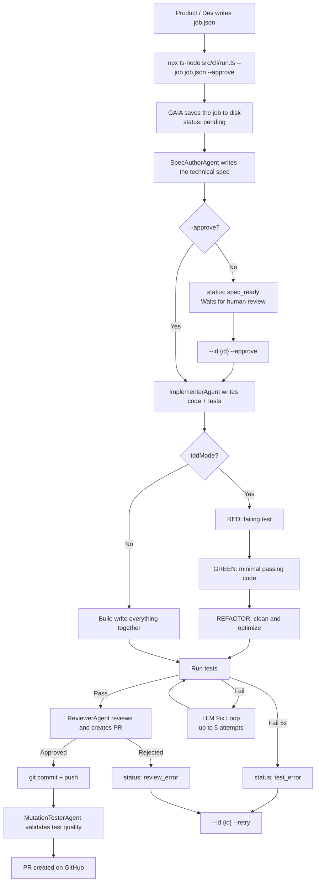

# GAIA CLI Mode — Product Guide

> How to use GAIA in artisan/local mode without relying on the HTTP server. Intended for product people who want to understand the flow without reading code.

---

## TL;DR

GAIA CLI Mode is a way to ask GAIA to implement a feature by running a single command in the terminal.

1. The user (dev or product) writes a **job card** in a file called `job.json`.
2. Runs `npx ts-node src/cli/run.ts --job job.json --approve`.
3. GAIA generates a technical proposal (spec), implements it, runs tests, reviews quality, and pushes the code to GitHub.
4. It finally returns the Pull Request link.

If `--approve` is not used, GAIA stops after generating the spec so a human can review it.

---

## What is CLI Mode?

GAIA has three usage modes:

| Mode             | How to launch                                    | Best for                                       |
| ---------------- | ------------------------------------------------ | ---------------------------------------------- |
| **HTTP Mode**    | Requests to a server (`POST /jobs`)              | Production, CI/CD, integrations                |
| **CLI Mode**     | One command in the terminal                      | Local development, artisan work with a dev     |
| **Webhook Mode** | Automatic triggers from Jira/Slack/GitHub      | Ticket automation                              |

**CLI Mode** is the most direct: no server, no external database, no polling. GAIA stores everything locally in the project's `progress/` folder.

**Analogy:** HTTP Mode is like ordering food through an app and waiting for notifications. CLI Mode is like cooking at home with a written recipe.

---

## What technology does it use?

You don't need to understand every technical detail, but here is a summary of what is under the hood:

| Technology                 | What is it?                                                                           | What is it for in GAIA CLI Mode?                                                                    |
| -------------------------- | ------------------------------------------------------------------------------------- | --------------------------------------------------------------------------------------------------- |
| **Node.js**                | The runtime that executes JavaScript/TypeScript programs.                             | It is the engine that runs GAIA on your machine.                                                    |
| **TypeScript**             | A typed version of JavaScript; helps prevent errors.                                  | All GAIA is written in TypeScript.                                                                  |
| **ts-node**                | A tool that runs TypeScript directly without compiling to JavaScript first.            | Lets you launch GAIA with `npx ts-node src/cli/run.ts ...` in one step.                             |
| **Git**                    | Version control system.                                                               | GAIA uses Git to create branches, commit changes, and push them to GitHub.                          |
| **GitHub API**             | GitHub's programming interface.                                                         | GAIA creates the Pull Request automatically.                                                        |
| **OpenAI / Anthropic LLM** | Large language models (generative AI).                                                  | They "think" and write the spec, code, tests, and reviews.                                        |
| **Local JSON files**       | Structured text files that store data.                                                  | GAIA saves the job state in `progress/.state/{id}.json` and a human-readable log in `progress/{id}.md`. |
| **Platform tests**         | `flutter test`, `xcodebuild test`, etc.                                                 | GAIA runs the project's tests to verify the change works.                                           |

**Analogy:** GAIA CLI Mode is like a personal assistant that reads your job card (`job.json`), researches the project, writes the draft, reviews it, delivers it on GitHub, and keeps a copy of everything in a local folder (`progress/`).

---

## When should I use CLI Mode?

- A dev wants to fix a bug or implement a small feature without spinning up a server.
- Product wants to quickly test an idea with a dev sitting nearby.
- You are debugging a GAIA behavior (that's why it's called "artisan mode").
- There is no need to expose a public API.

---

## What do I need to run it?

Two things:

1. A `job.json` file describing the work.
2. The command:

```bash
npx ts-node src/cli/run.ts --job job.json --approve
```

- `--job job.json` tells GAIA where the job card is.
- `--approve` tells it not to wait for human approval and go straight to implementation.

If you omit `--approve`, GAIA will stop at `spec_ready` and the dev must approve with:

```bash
npx ts-node src/cli/run.ts --id <job-id> --approve
```

---

## What goes inside `job.json`?

It is a text file with the following structure:

```json
{
  "platform": "flutter_web",
  "repo": "rpp-co/rpp-cashflow-multiplatform-pyme",
  "targetBranch": "docs/gaia-conventions",
  "title": "Handle SummaryFormSuccess in Bre-B presummary",
  "module": "presummary_form",
  "acceptanceCriteria": [
    "When notifier emits SummaryFormSuccess render success view",
    "When notifier emits SummaryFormError render GenericError with retry and back"
  ],
  "tddMode": true,
  "requireTests": true,
  "maxFilesToTouch": 3
}
```

### Field by field

| Field                | Required? | Meaning                                                                                                                                                       | Example                                         |
| -------------------- | --------- | ------------------------------------------------------------------------------------------------------------------------------------------------------------- | ----------------------------------------------- |
| `platform`           | Yes       | Project technology. Can be `flutter_web`, `ios`, `android`.                                                                                                   | `flutter_web`                                   |
| `repo`               | Yes       | GitHub repository where GAIA will make the change, in `owner/repo` format.                                                                                   | `rpp-co/rpp-cashflow-multiplatform-pyme`        |
| `targetBranch`       | No        | Base branch for the PR. Defaults to `develop` if omitted.                                                                                                     | `docs/gaia-conventions`                         |
| `title`              | Yes       | Short, clear title of what is being asked.                                                                                                                  | `Handle SummaryFormSuccess in Bre-B presummary` |
| `module`             | No        | Module or functional area of the product being touched. Helps GAIA focus.                                                                                     | `presummary_form`                               |
| `acceptanceCriteria` | Yes       | List of phrases describing what must happen for the work to be considered correct. Must be testable.                                                        | See example above                               |
| `tddMode`            | No        | If `true`, GAIA writes the test first and then the code (Red-Green-Refactor). If `false`, it writes everything together.                                     | `true`                                          |
| `requireTests`       | No        | If `true`, GAIA must create or update tests. Almost always `true`.                                                                                            | `true`                                          |
| `maxFilesToTouch`    | No        | Limit on files GAIA can modify. Prevents giant changes. Defaults to `5`.                                                                                    | `3`                                             |
| `description`        | No        | Additional context, product notes, links, etc.                                                                                                                | `"See Figma: ..."`                              |
| `figmaUrl`           | No        | Link to the Figma design. If `FIGMA_ACCESS_TOKEN` is configured, GAIA reads the frame/node and adds layout, text, colors, and hierarchy to the spec prompt. | `https://www.figma.com/...`                     |
| `jiraTicketId`       | No        | If the work comes from a Jira ticket, you can put it here.                                                                                                   | `RPP-1234`                                      |

### Writing good acceptance criteria

They are the most important part of `job.json`. A good criterion:

- Starts with an action (`When ...`, `Given ... Then ...`).
- Is observable without reading code (can be seen in the UI or in a test result).
- Is small: one criterion = one thing.

**Good examples:**

- `When the user taps “Retry”, the presummary reloads.`
- `When the presummary service fails, the error screen shows “Retry” and “Back” buttons.`
- `When the presummary succeeds, the success screen shows a button to navigate to Summary.`

**Bad example:**

- `Fix the bug.` (Cannot be verified.)

---

## Step-by-step flow



### Explanation of each step

1. **Write `job.json`**: Product or dev describes what is wanted and how to know it is ready.
2. **Launch command**: GAIA reads the file and creates a local job. It saves the state in `progress/.state/{id}.json` and a readable log in `progress/{id}.md`.
3. **SpecAuthorAgent**: GAIA researches the repo, identifies relevant files, and writes a technical proposal (the _spec_). It is like the blueprint of a construction project.
4. **Approval**: If `--approve` was not used, GAIA stops here. A human reviews the spec and approves.
5. **ImplementerAgent**: GAIA writes the code and tests.
   - In TDD mode: first a failing test, then the code, then cleanup.
   - In bulk mode: writes everything together.
6. **Run tests**: GAIA runs the project's tests. If they fail, it tries to fix automatically up to 5 times.
7. **ReviewerAgent**: GAIA reviews quality, style, architecture, and creates the Pull Request on GitHub.
8. **MutationTesterAgent**: GAIA introduces small artificial errors into the code to see if the tests catch them. If the _kill rate_ is below 80%, it may ask for more tests.
9. **PR ready**: Dev receives the PR link for final human review.

---

## Job states

| State             | What it means in human language                                               | Who acts             |
| ----------------- | ------------------------------------------------------------------------------- | -------------------- |
| `pending`         | The job has just been created and is queued.                                    | System               |
| `spec_generating` | GAIA is writing the technical proposal.                                         | SpecAuthorAgent      |
| `spec_ready`      | The spec is ready and **GAIA waits for human approval**.                        | Human                |
| `spec_approved`   | A human (or `--approve`) approved the spec.                                       | System               |
| `implementing`    | GAIA is writing code and tests.                                                 | ImplementerAgent     |
| `reviewing`       | GAIA reviews the code and creates the PR.                                       | ReviewerAgent        |
| `pr_created`      | The PR already exists on GitHub; GAIA validates tests with mutation.            | MutationTesterAgent  |
| `done`            | Everything ready. The PR URL is delivered.                                      | —                    |
| `test_error`      | Tests failed after 5 automatic attempts. Can be retried.                        | Human (`--retry`)    |
| `review_error`    | The reviewer found serious issues after 5 attempts. Can be retried.             | Human (`--retry`)    |
| `failed`          | Unrecoverable error (for example, the repo does not respond or spec was rejected). | Human             |

---

## Useful commands

### Create and run a new job

```bash
npx ts-node src/cli/run.ts --job job.json --approve
```

### Create a job without auto-approving (pause at spec_ready)

```bash
npx ts-node src/cli/run.ts --job job.json
```

### Approve an existing job and continue

```bash
npx ts-node src/cli/run.ts --id <job-id> --approve
```

### Retry a failed job

```bash
npx ts-node src/cli/run.ts --id <job-id> --retry
```

### Create a job from a Jira ticket

```bash
npx ts-node src/cli/run.ts --jira RPP-1234 --approve
```

### List all local jobs

```bash
npx ts-node src/cli/run.ts --list
```

---

## Key differences with HTTP Mode

| Topic         | HTTP Mode                          | CLI Mode                                    |
| ------------- | ---------------------------------- | ------------------------------------------- |
| How to launch | HTTP request (`POST /jobs`)        | Terminal command                            |
| Persistence   | Postgres database                  | Local JSON files in `progress/.state/`     |
| Approval      | Endpoint `POST /jobs/:id/approve`  | Flag `--approve` or `--id <id> --approve`   |
| Retry         | Endpoint `POST /jobs/:id/retry`    | Flag `--id <id> --retry`                    |
| Best for      | Production, CI/CD, many users      | Local work, debugging, fast iteration       |

---

## Glossary

- **Spec**: Technical proposal that GAIA generates before writing code. Includes tasks, files to touch, and detailed acceptance criteria.
- **TDD (Test-Driven Development)**: Test first, then code. Safer but slower.
- **Bulk**: Write code and tests at the same time. Faster, less step-by-step control.
- **Mutation testing**: GAIA intentionally "breaks" the code to see if the tests catch it. Measures test quality.
- **PR (Pull Request)**: Request to merge the new code into the repo's main branch.
- **Job**: A unit of work for GAIA. Equivalent to a feature, bug, or improvement.

---

## FAQ

**Can product launch a job directly?**
Yes, if they have access to the repo and a configured terminal. In practice it is usually a dev who runs the command, but the `job.json` can be written together.

**What happens if GAIA doesn't understand something in `job.json`?**
GAIA will generate a spec that reflects the ambiguity. That is why acceptance criteria must be clear.

**Why use `--approve`?**
To avoid stopping to review the spec. Useful for fast iterations or when the spec is already known in advance.

**Where do I see progress?**
In two places:

- `progress/.state/{id}.json`: technical state in JSON.
- `progress/{id}.md`: human-readable log.

**Does CLI Mode modify the local repo?**
GAIA clones the repo to a temporary working folder (`/tmp/gaia-workspace/{jobId}`), makes changes there, and pushes the branch to the remote. The dev's local repo is not touched.

---

## Related links

- [`docs/guides/gaia-http-flow.md`](gaia-http-flow.md) — HTTP server flow version.
- [`src/cli/run.ts`](../../src/cli/run.ts) — CLI entry point (for devs).
- CLI flow FigJam: https://www.figma.com/board/hg8uzqC0Wx17t3XNlSvfEe
