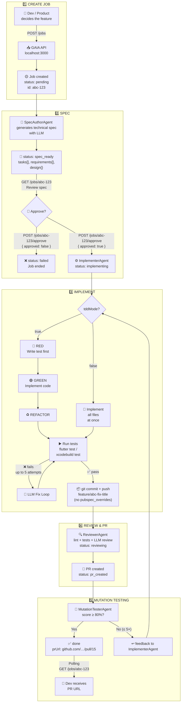

# GAIA HTTP Mode — Full Flow

> Visual guide for developers and product.  
> Paste the Mermaid block in [mermaid.live](https://mermaid.live) or FigJam (Insert → Diagram).

---

## Main diagram



---

## Real example — feature `fix-empty-page-state-in-list-notifier`

### Step 1 — Create job

```bash
curl -X POST http://localhost:3000/jobs \
  -H "Content-Type: application/json" \
  -d '{
    "platform": "flutter_web",
    "title": "Fix emptyPage state logic in ListNotifier",
    "repo": "my-org/my-flutter-web-app",
    "targetBranch": "main",
    "module": "account_summary",
    "tddMode": true,
    "acceptanceCriteria": [
      "When loadFirstPage receives non-empty content, pageState is pageLoaded",
      "When loadFirstPage receives empty content, pageState is emptyPage",
      "When loadNextPage adds content to an existing list, pageState is pageLoaded",
      "When repository throws, pageState is pageError"
    ]
  }'
```

**Response:**

```json
{
  "job": {
    "id": "a8523665-99db-41e1-9e39-bc9aaa75b5f7",
    "status": "pending",
    "title": "Fix emptyPage state logic in ListNotifier"
  }
}
```

---

### Step 2 — Wait for spec and review it

```bash
# Poll until spec_ready
curl http://localhost:3000/jobs/a8523665-99db-41e1-9e39-bc9aaa75b5f7
```

```json
{
  "job": {
    "status": "spec_ready",
    "spec": {
      "tasks": [
        {
          "id": "TASK-001",
          "type": "modify",
          "filePath": "packages/features/account_summary/lib/src/presentation/modules/list/list_providers.dart",
          "description": "Fix _setNewPageLoaded: use newList.isEmpty instead of state.page == 0"
        },
        {
          "id": "TASK-002",
          "type": "test",
          "filePath": "packages/features/account_summary/test/presentation/modules/list/list_notifier_test.dart",
          "description": "Unit tests for ListNotifier covering all ACs"
        }
      ]
    }
  }
}
```

---

### Step 3 — Approve spec

```bash
curl -X POST http://localhost:3000/jobs/a8523665-.../approve \
  -H "Content-Type: application/json" \
  -d '{"approved": true}'
```

**Response:** `{ "job": { "status": "implementing" } }`

---

### Step 4 — Poll until done

```bash
# Every 10s until status is "done" or "test_error"
curl http://localhost:3000/jobs/a8523665-...
```

**State progression:**

```
pending → spec_generating → spec_ready
  → (human approval)
  → implementing → reviewing → done
```

**If tests fail** → `test_error` → retry:

```bash
curl -X POST http://localhost:3000/jobs/a8523665-.../retry
```

---

### Step 5 — PR ready

```json
{
  "job": {
    "status": "done",
    "prUrl": "https://github.com/my-org/my-flutter-web-app/pull/15",
    "branchName": "feature/a8523665-fix-emptypage-state-logic-in-listnotif"
  }
}
```

---

## Job states

| State             | Who                 | What happens                                         |
| ----------------- | ------------------- | ---------------------------------------------------- |
| `pending`         | System              | Job queued                                           |
| `spec_generating` | SpecAuthorAgent     | LLM generating spec                                  |
| `spec_ready`      | —                   | **⏸ Waits for human approval**                       |
| `implementing`    | ImplementerAgent    | Writes code + tests                                  |
| `reviewing`       | ReviewerAgent       | Lint + tests + LLM review + PR                       |
| `pr_created`      | MutationTesterAgent | Mutation testing post-PR                             |
| `done`            | —                   | PR created on GitHub                                 |
| `test_error`      | —                   | Tests/mutation failed after retries → `/retry`     |
| `review_error`    | —                   | Reviewer found issues; feedback to Implementer      |
| `failed`          | —                   | Unrecoverable error or spec rejected                |

---

## Endpoint summary

| Method | Endpoint            | For what                     |
| ------ | ------------------- | ---------------------------- |
| `POST` | `/jobs`             | Create new job               |
| `GET`  | `/jobs/:id`         | View status and spec         |
| `POST` | `/jobs/:id/approve` | Approve or reject spec       |
| `POST` | `/jobs/:id/retry`   | Retry after `test_error`     |
| `GET`  | `/jobs`             | List all jobs                |
