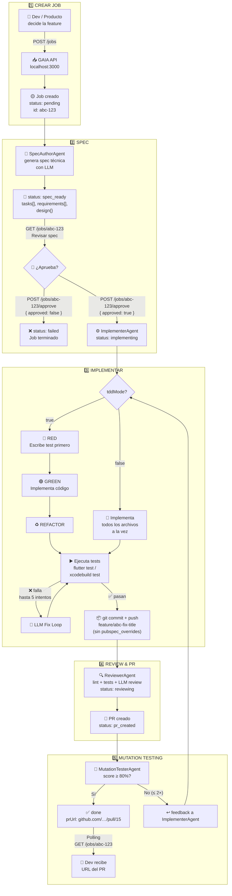

# GAIA HTTP Mode — Flujo Completo

> Guía visual para desarrolladores y producto.  
> Pega el bloque Mermaid en [mermaid.live](https://mermaid.live) o en FigJam (Insert → Diagram).

---

## Diagrama principal



---

## Ejemplo real — feature `fix-pyme-wall-movements-empty-page-state`

### Paso 1 — Crear job

```bash
curl -X POST http://localhost:3000/jobs \
  -H "Content-Type: application/json" \
  -d '{
    "platform": "flutter_web",
    "title": "Fix emptyPage state logic in PymeWallMovementsListNotifier",
    "repo": "rpp-co/rpp-account-basics-multiplatform-pyme",
    "targetBranch": "master",
    "module": "account_summary",
    "tddMode": true,
    "acceptanceCriteria": [
      "When loadFirstPage receives non-empty content, pageState is pageLoaded",
      "When loadFirstPage receives empty content, pageState is emptyPage",
      "When loadNextPage adds content to an existing list, pageState is pageLoaded",
      "When repository throws, pageState is pageError"
    ]
  }'
```

**Respuesta:**

```json
{
  "job": {
    "id": "a8523665-99db-41e1-9e39-bc9aaa75b5f7",
    "status": "pending",
    "title": "Fix emptyPage state logic in PymeWallMovementsListNotifier"
  }
}
```

---

### Paso 2 — Esperar spec y revisarla

```bash
# Polling hasta spec_ready
curl http://localhost:3000/jobs/a8523665-99db-41e1-9e39-bc9aaa75b5f7
```

```json
{
  "job": {
    "status": "spec_ready",
    "spec": {
      "tasks": [
        {
          "id": "TASK-001",
          "type": "modify",
          "filePath": "packages/features/account_summary/lib/src/presentation/modules/pyme_wall_movements/pyme_wall_movements_providers.dart",
          "description": "Fix _setNewPageLoaded: use newMovementsList.isEmpty instead of state.page == 0"
        },
        {
          "id": "TASK-002",
          "type": "test",
          "filePath": "packages/features/account_summary/test/presentation/modules/pyme_wall_movements/pyme_wall_movements_list_notifier_test.dart",
          "description": "Unit tests for PymeWallMovementsListNotifier covering all ACs"
        }
      ]
    }
  }
}
```

---

### Paso 3 — Aprobar spec

```bash
curl -X POST http://localhost:3000/jobs/a8523665-.../approve \
  -H "Content-Type: application/json" \
  -d '{"approved": true}'
```

**Respuesta:** `{ "job": { "status": "implementing" } }`

---

### Paso 4 — Polling hasta done

```bash
# Cada 10s hasta que status sea "done" o "test_error"
curl http://localhost:3000/jobs/a8523665-...
```

**Progresión de estados:**

```
pending → spec_generating → spec_ready
  → (aprobación humana)
  → implementing → reviewing → done
```

**Si falla tests** → `test_error` → hacer retry:

```bash
curl -X POST http://localhost:3000/jobs/a8523665-.../retry
```

---

### Paso 5 — PR listo

```json
{
  "job": {
    "status": "done",
    "prUrl": "https://github.com/rpp-co/rpp-account-basics-multiplatform-pyme/pull/15",
    "branchName": "feature/a8523665-fix-emptypage-state-logic-in-pymewallmov"
  }
}
```

---

## Estados del job

| Estado            | Quién               | Qué pasa                                             |
| ----------------- | ------------------- | ---------------------------------------------------- |
| `pending`         | Sistema             | Job en cola                                          |
| `spec_generating` | SpecAuthorAgent     | LLM generando spec                                   |
| `spec_ready`      | —                   | **⏸ Espera aprobación humana**                       |
| `implementing`    | ImplementerAgent    | Escribe código + tests                               |
| `reviewing`       | ReviewerAgent       | Lint + tests + LLM review + PR                       |
| `pr_created`      | MutationTesterAgent | Mutation testing post-PR                             |
| `done`            | —                   | PR creado en GitHub                                  |
| `test_error`      | —                   | Tests/mutación fallaron tras reintentos → `/retry`   |
| `review_error`    | —                   | Reviewer encontró problemas; feedback al Implementer |
| `failed`          | —                   | Error irrecuperable o spec rechazada                 |

---

## Resumen de endpoints

| Método | Endpoint            | Para qué                     |
| ------ | ------------------- | ---------------------------- |
| `POST` | `/jobs`             | Crear nuevo job              |
| `GET`  | `/jobs/:id`         | Ver estado y spec            |
| `POST` | `/jobs/:id/approve` | Aprobar o rechazar spec      |
| `POST` | `/jobs/:id/retry`   | Reintentar tras `test_error` |
| `GET`  | `/jobs`             | Listar todos los jobs        |
